<br />
<div align=center>
    <a id="back-to-top"></a>
    <div align="center">
        <a href="https://github.com/dippyshere/battle-breakers-private-server">
            
        </a>
    </div>
  <h4>A server reimplementation (private server) for <a href="https://en.wikipedia.org/wiki/Battle_Breakers">Battle Breakers</a></h4>
</div>

___

## About The Game

Battle Breakers was a cartoon-themed Hero collector, Turn-Based, and Action RPG game developed by Chair Entertainment
and Epic Games in 2014-2019. Released in beta in 2016 and launched in 2019, the game has since been shut down at the end
of 2022.

## About This Project

This project is a **complete reimplementation** of every Epic Games backend service required to run and play the game
(AKA: Private Server, Server Emulator, Game Server, etc.). It is designed to be a drop-in replacement for the original
game servers, allowing the game to be played as it was when it was live.
It strives to be as complete and accurate as possible, to preserve the game and its legacy. It aims to be **fully
compatible** with all versions of the game, on all platforms, from the 2017 beta to the final release.

[This project](https://github.com/dippyshere/battle-breakers-private-server) would not have been possible
without [the data](https://github.com/dippyshere/battle-breakers-documentation) [I](https://github.com/dippyshere)
captured, the help and data provided by [Lele](https://github.com/LeleDerGrasshalmi/) and
his [Epic Games Documentation](https://github.com/LeleDerGrasshalmi/FortniteEndpointsDocumentation/), and the combined
game knowledge of the [Battle Breakers community](https://discord.gg/3Hpv72hvvx).

## Project Goals

- [x] **Fully Compatible**: The server should be able to support all versions of the game, from the 2017 beta to the
  final release.
- [ ] **Stable and Secure**: The server should be stable and secure.
- [ ] **Complete and Accurate**: The server should be as complete and accurate as possible, implementing all features
  and services used by the game.

## Features

#### Services

- [x] Account Service
- [x] Affiliate Service
- [x] Battle Breakers CDN
- [x] Catalog Service
- [x] Datarouter Service
- [x] Entitlement Service
- [x] EULA Tracking Service
- [x] Friends Service
- [x] Lightswitch Service
- [x] Presence Service
- [x] Price Engine Service
- [ ] WEX (Game) Service

#### Game Service

- [x] Calendar Timeline (Battle Pass, Events, etc.)
- [ ] Catalog (IAPs, Various storefronts, etc.)
- [x] Cloud Storage (Config file hotfixes)
- [x] Entitlements
- [x] Friends
- [x] Item Rating
- [x] Manifests
- [x] Receipts
- [x] Version Checks
- [ ] MCP (Profile, All menu actions, etc.)
    - [ ] AbandonLevel
    - [x] AddEpicFriend
    - [x] AddFriend
    - [x] AddToMonsterPit
    - [ ] BlitzLevel
    - [x] BulkImproveHeroes
    - [x] BuyBackFromMonsterPit
    - [x] CashOutWorkshop
    - [ ] ClaimAccountReward
    - [ ] ClaimEventRewards
    - [ ] ClaimGiftPoints
    - [x] ClaimLoginReward
    - [x] ClaimNotificationOptInReward
    - [ ] ClaimQuestReward
    - [ ] ClaimTerritory
    - [x] ClientTrackedRetentionAnalytics
    - [x] DeleteFriend
    - [ ] EvolveHero
    - [ ] FinalizeLevel
    - [x] FoilHero
    - [ ] GenerateDailyQuests
    - [ ] GenerateMatchWithFriend
    - [ ] InitalizeLevel
    - [ ] JoinMatchmaking
    - [x] LevelUpHero
    - [x] MarkHeroSeen
    - [x] MarkItemSeen
    - [x] ModifyHeroArmor
    - [x] ModifyHeroGear
    - [x] ModifyHeroWeapon
    - [ ] OpenGiftBox
    - [ ] OpenHeroChest
    - [ ] PickHeroChest
    - [ ] PromoteHero
    - [ ] PurchaseCatalogEntry
    - [x] QueryProfile
    - [ ] RedeemToken
    - [x] RemoveFromMonsterPit
    - [ ] RollHammerChests
    - [x] SelectHammerChest
    - [x] SelectStartOptions
    - [x] SellGear
    - [x] SellHero
    - [x] SellMultipleGear
    - [x] SellTreasure
    - [ ] SendGiftPoints
    - [x] SuggestFriends
    - [x] SuggestionResponse
    - [ ] TapHammerChest
    - [x] UnlockArmorGear
    - [x] UnlockHeroGear
    - [x] UnlockRegion
    - [x] UnlockWeaponGear
    - [x] UpdateAccountHeadlessStatus
    - [x] UpdateFriends
    - [ ] UpdateMonsterPitPower
    - [x] UpdateParty
    - [x] UpgradeBuilding
    - [x] UpgradeHero
    - [x] UpgradeHeroSkills
    - [x] VerifyRealMoneyPurchase

## Self-Hosting the Server

### Prerequisites

- [Python 3.11+](https://www.python.org/downloads/)
- [MongoDB](https://www.mongodb.com/try/download/community)

### Installation

1. Clone the repository

    ```sh
    git clone --recurse-submodules https://github.com/dippyshere/battle-breakers-private-server.git
    cd battle-breakers-private-server
    ```

2. Install the required packages

    ```sh
    pip install -r requirements.txt
    ```

3. Start the MongoDB server

   (Windows)
    ```cmd
    net start MongoDB
    ```

   (Linux)
    ```bash
    sudo systemctl start mongod
    ```

   (macOS)
    ```shell
    brew services start mongodb-community
    ```

4. Start the server

    ```sh
    sanic main:app
    ```
5. Configure the game to connect to your server

## Contributing

Any contributions you make are **greatly appreciated**. Please read the [CONTRIBUTING.md](CONTRIBUTING.md) file for more
details.

## Contact

If you have any questions, suggestions, or would like to get back into a Battle Breakers community, please join the
[Discord server](https://discord.gg/3Hpv72hvvx)! You can also contact me directly via the Discord server
(dippy is not here).

## Licence

This project is licenced under the Breakers Revived License (BRL) - see the [LICENSE](LICENSE) file for details.

## Support & Community

If you need help with anything, or have any questions, suggestions / requests, or would like to get back into a Battle
Breakers community, please join the [Discord server](https://discord.gg/3Hpv72hvvx)!

___

###### <p align=center> Portions of the materials used are trademarks and/or copyrighted works of Epic Games, Inc. </p>

###### <p align=center> All rights reserved by Epic. </p>

###### <p align=center> This material is not official and is not endorsed by Epic. </p>

<div align="center">
<a href="https://discord.gg/3Hpv72hvvx"></a>


<br>
🫡🔫
</div>
